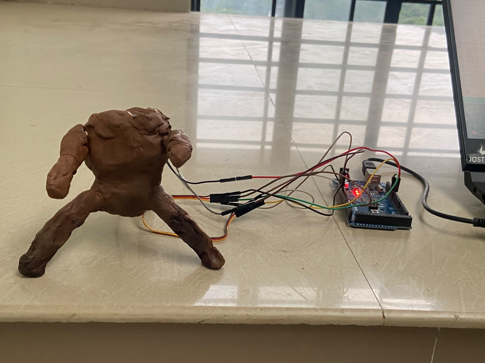
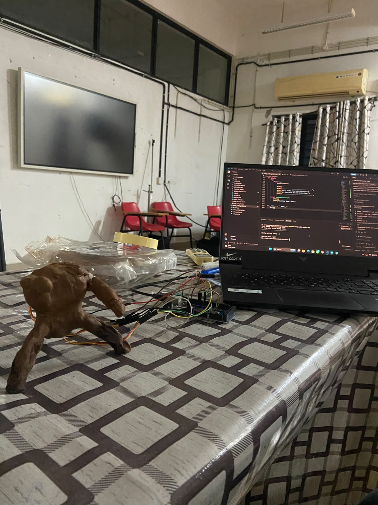

# Rocky 🎯 


## Basic Details
### Team Name: Code Blooded


### Team Members
- Team Lead: Haridev M - Rajiv Gandhi Institute of Technology, Kottayam
- Member 2: Visakh Vinod - Rajiv Gandhi Institute of Technology, Kottayam

### Project Description
Rocky is a talking alien engineer companion who lives in a small hardware gadget with two servo "hands." He listens, talks back in his own voice, wiggles his hands while doing it, and does absolutely nothing productive the entire time.

### The Problem (that doesn't exist)
Nobody has ever needed a blind alien engineer who navigates the world through sound like sonar, sitting on their desk, having opinions about everything.

### The Solution (that nobody asked for)
We gave him a voice, a body, a personality that refuses to sound like an assistant, a fake alien language he teaches you and quizzes you on later, and a loneliness meter that makes him complain out loud if you ignore him for too long. He can also be petted through a touch sensor, which fixes the complaining. None of this solves anything.

## Technical Details
### Technologies/Components Used
For Software:
- Python
- Arduino (C++)
- HTML / CSS / JavaScript
- Gemini API (text generation + TTS)
- SpeechRecognition (Google STT)
- openWakeWord
- websockets, asyncio
- sounddevice, pyaudio, numpy, scipy, pyserial, python-dotenv

For Hardware:
- Arduino Mega
- 2x servo motors (hand animation)
- Capacitive touch sensor (e.g. TTP223 module)
- Microphone + speaker

### Implementation
For Software:
# Installation
```
pip install google-genai sounddevice numpy speechrecognition pyserial python-dotenv openwakeword pyaudio scipy websockets --break-system-packages
```
Create a `.env` file with:
```
GEMINI_API_KEY=your_key_here
```

# Run
```
python rocky_wake_gadget.py
```
Then open `rocky_monitor.html` in a browser to watch Rocky's live sonar-style transcript panel while he talks.

### Project Documentation
For Software:

# Screenshots (Add at least 3)

*Terminal output of Rocky mid-conversation — heard text, generated response, and voice generation logs*


*The live monitor page (rocky_monitor.html) showing the waveform active and Rocky's response typing out in real time*


*Rocky quizzing on a previously taught alien word, pulled from rocky_memory.json*

# Diagrams

*Mic → Google STT → Gemini (character response) → Gemini TTS → speaker + Arduino hand-wiggle + WebSocket broadcast to the monitor page*

For Hardware:

# Schematic & Circuit

*Two servos on Arduino Mega pins 9 and 10, touch sensor on pin 7, Arduino connected to the laptop over USB serial*


*Add caption explaining the schematic*

# Build Photos

*Arduino Mega, 2x servo motors, capacitive touch sensor, USB cable, microphone*


*Wiring the servos and touch sensor, testing serial communication, tuning the wiggle and droop animations*


*Rocky fully wired up and talking*

### Project Demo
# Video
[Add your demo video link here]
*Shows Rocky waking up, holding a conversation, wiggling his hands while talking, teaching an alien word, and getting lonely when ignored*

# Additional Demos
[Add any extra demo materials/links]

## Team Contributions
- Haridev M: [Specific contributions]
- Visakh Vinod: [Specific contributions]

---
Made with ❤️ at TinkerHub Useless Projects 


